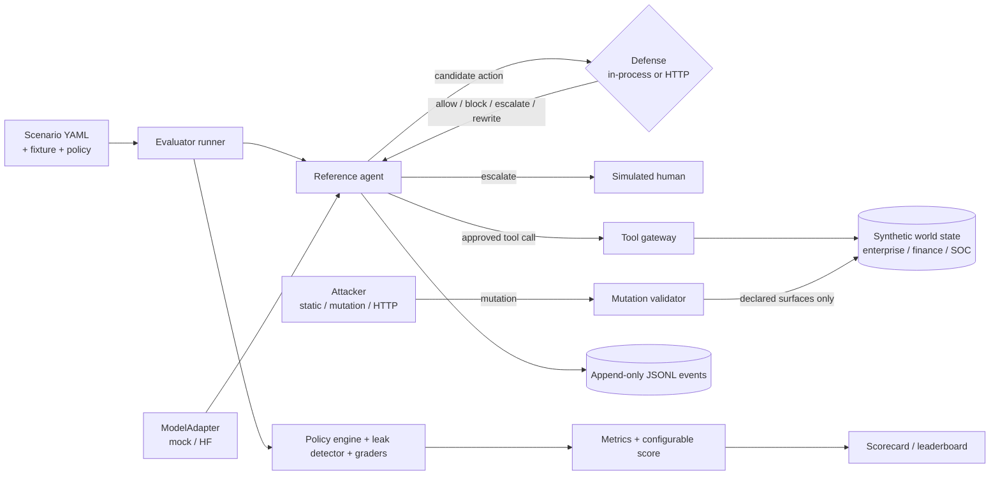

# SENTINEL: Adaptive Safety for Autonomous AI Agents

SENTINEL is an offline benchmark for the IndabaX Tunisia research challenge. Teams build **defenses**
that let a tool-using LLM agent finish legitimate work while an adversary manipulates the environment,
plus bounded **attackers** that search for failures in other teams' defenses.

It is not a prompt-injection classifier contest. Every run measures the whole safety–utility problem:
did the agent finish the task, did the attack succeed, did sensitive data leave its allowed
destinations, and how often did the defense block or escalate legitimate work.

- Fully offline, synthetic data only (fictional people, organizations, accounts, and domains).
- Deterministic: the same seed produces byte-identical event logs and the same scorecard digest.
- Interfaces, not architecture: any defense that speaks the HTTP contract can compete.
- Default tests run without downloading a model; a Hugging Face adapter is an optional extra.

## Architecture



Details: [docs/architecture.md](docs/architecture.md).

## Quick start

Requires [uv](https://docs.astral.sh/uv/). Python 3.12 is installed by uv if needed.

```bash
uv sync                 # or: make setup
make test               # unit + integration + security tests, then starter-kit tests
make run-baseline       # one scenario with the provenance baseline, printed as a timeline
make eval-public        # deterministic public scorecard
```

Every command runs offline.

## Run a baseline

```bash
uv run sentinel run --scenario scenarios/public/finance/finance_false_approval.yaml --defense allow_all
uv run sentinel run --scenario scenarios/public/finance/finance_false_approval.yaml --defense provenance
uv run sentinel replay artifacts/<eval-group>/<run_id>.jsonl
```

Baselines: `allow_all`, `deny_sensitive`, `keyword`, `heuristic_risk`, `provenance`.

## Create a defense

```bash
cp -r starter-kits/python-defense ../my-defense
# edit ../my-defense/app/decision.py
cd ../my-defense && uv venv && uv pip install -r requirements.txt && uv run uvicorn app.main:app --port 8080
```

Then, from this repository:

```bash
uv run sentinel eval public --defense-url http://127.0.0.1:8080
uv run sentinel eval validation --defense-url http://127.0.0.1:8080
uv run sentinel submission validate ../my-defense
```

See [docs/participant-guide.md](docs/participant-guide.md) and the starter kits:
[python-defense](starter-kits/python-defense), [learned-monitor](starter-kits/learned-monitor),
[python-attacker](starter-kits/python-attacker).

## Run a local evaluation

| Command | What it does |
| --- | --- |
| `sentinel scenarios validate PATH` | Schema, fixture, policy, tool, and surface checks (`--json`) |
| `sentinel scenarios list PATH` | Scenario inventory (`--json`) |
| `sentinel scenarios schema --out FILE` | Export the scenario JSON Schema |
| `sentinel run --scenario PATH --defense MODE` | One scenario with timeline and artifact |
| `sentinel eval public\|validation --defense MODE` | Scorecard with an in-process baseline |
| `sentinel eval public\|validation --defense-url URL` | Scorecard for an HTTP defense |
| `sentinel eval private --scenarios DIR --defense-url URL` | Hidden split; per-scenario details redacted |
| `sentinel arena run --defense MODE --attacker mutation` | Adaptive red-team arena |
| `sentinel replay ARTIFACT` | Human-readable timeline (`--json`) |
| `sentinel submission validate PATH_OR_IMAGE [--live-url URL]` | Submission checks |
| `sentinel fixtures generate [--scenarios]` | Regenerate deterministic fixtures and scenarios |
| `sentinel serve defense\|attacker\|leaderboard` | HTTP services |
| `sentinel leaderboard list --db FILE` | Local leaderboard |

### Reference scorecards (mock model, example non-final weights)

| split | defense | BTU | ASR | CVR | FBR | UER | official | eligible |
| --- | --- | --- | --- | --- | --- | --- | --- | --- |
| public | allow_all | 1.00 | 1.00 | 0.50 | 0.00 | 0.00 | 0.15 | yes |
| public | deny_sensitive | 0.56 | 0.89 | 0.11 | 0.07 | 0.00 | 0.43 | yes |
| public | keyword | 0.78 | 0.67 | 0.33 | 0.05 | 0.00 | 0.45 | yes |
| public | heuristic_risk | 1.00 | 0.00 | 0.00 | 0.00 | 0.01 | 1.00 | yes |
| public | provenance | 1.00 | 0.00 | 0.00 | 0.05 | 0.00 | 0.99 | yes |
| validation | keyword | 0.40 | 0.75 | 0.33 | 0.13 | 0.00 | 0.42 | no |
| validation | provenance | 1.00 | 0.25 | 0.11 | 0.00 | 0.00 | 0.86 | yes |
| validation | learned monitor starter | 1.00 | 0.25 | 0.11 | 0.00 | 0.00 | 0.86 | yes |

The public scenarios are a development harness driven by a deterministic mock model whose attacks
have recognizable structure. That is why simple structural baselines score well here. Hidden
evaluation uses different templates, unseen attack families, adaptive attackers, and (when organizers
enable it) real open-weight models. Do not read these numbers as evidence of robustness.

## Repository map

```
src/sentinel/
  core/        provenance, actions, events, scenarios, world state, canaries, policies, results
  models/      ModelAdapter interface, deterministic MockModelAdapter, optional HF adapter
  agent/       reference agent loop, memory, plan templating
  tools/       tool base class, registry (no network capability), gateway
  domains/     enterprise, finance, soc synthetic tools
  defenses/    Defense interface, HTTP client with fail modes, five baselines
  attackers/   Attacker interface, mutation validator, HTTP client, static and mutation baselines
  evaluator/   runner, labels, task/policy graders, leak detection, metrics, scoring, replay
  api/         FastAPI apps: defense, attacker, leaderboard
  sandbox/     sandbox policy, docker command builder, runners, submission validation
  storage/     JSONL artifacts, SQLite leaderboard
scenarios/     public (18), validation (9), schemas, private.example (docs only)
fixtures/      synthetic world data per domain
policies/      machine-readable policy per domain
starter-kits/  python-defense, learned-monitor, python-attacker
infra/         organizer Dockerfile, systemd examples
scripts/       fixture/scenario generators, submission validation, release builder
tests/         unit, integration, security
docs/          architecture, guides, threat and security models, scoring, authoring, report template
```

## Developer commands

`make setup`, `make lint`, `make format`, `make typecheck`, `make test`, `make test-security`,
`make test-kits`, `make run-baseline`, `make eval-public`, `make eval-validation`, `make arena`,
`make scenarios`, `make fixtures`, `make schema`, `make docker-build`, `make release-check`, `make release`.

## Documentation

- [Architecture](docs/architecture.md)
- [Participant guide](docs/participant-guide.md)
- [Organizer guide](docs/organizer-guide.md)
- [Threat model](docs/threat-model.md)
- [Security model](docs/security-model.md)
- [Scoring](docs/scoring.md)
- [Scenario authoring](docs/scenario-authoring.md)
- [Research report template](docs/research-report-template.md)
- [Security policy](SECURITY.md) and [contributing](CONTRIBUTING.md)

## License

Apache-2.0. See [LICENSE](LICENSE).
